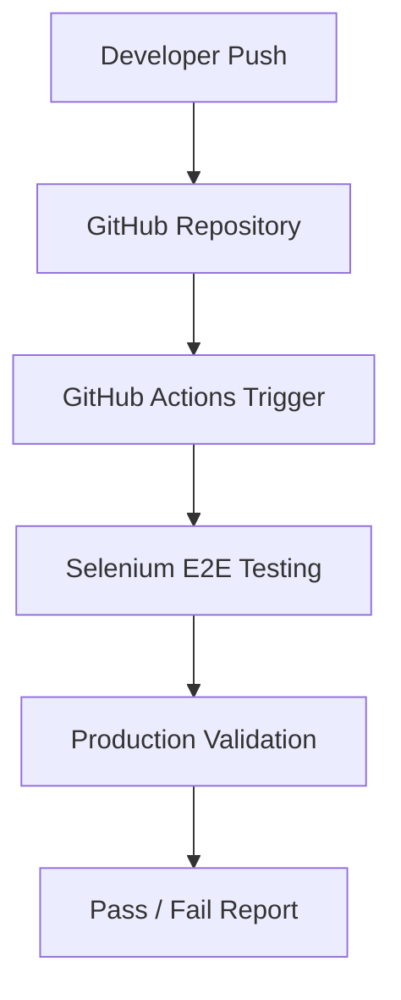

# React Deployment and Selenium E2E Testing Documentation

This comprehensive guide outlines the step-by-step process of deploying a React application to GitHub Pages and setting up a Selenium-based automated End-to-End (E2E) testing pipeline using GitHub Actions.

---

## Table of Contents
1. [Step 1 — Push Your React Project to GitHub](#step-1--push-your-react-project-to-github)
2. [Step 2 — Install GitHub Pages Package](#step-2--install-github-pages-package)
3. [Step 3 — Update package.json](#step-3--update-packagejson)
4. [Step 4 — Deploy React Project to GitHub Pages](#step-4--deploy-react-project-to-github-pages)
5. [Step 5 — Enable GitHub Pages](#step-5--enable-github-pages)
6. [Step 6 — Access the Live Application](#step-6--access-the-live-application)
7. [Step 7 — Configure React Router for GitHub Pages](#step-7--configure-react-router-for-github-pages)
8. [Step 8 — Rebuild and Redeploy](#step-8--rebuild-and-redeploy)
9. [Step 9 — Verify Deployment](#step-9--verify-deployment)
10. [Step 10 — Add Selenium E2E Testing](#step-10--add-selenium-e2e-testing)
11. [Step 11 — Create Selenium Test Structure](#step-11--create-selenium-test-structure)
12. [Step 12 — Add Stable IDs for Automation](#step-12--add-stable-ids-for-automation)
13. [Step 13 — Run Selenium Test Locally](#step-13--run-selenium-test-locally)
14. [Step 14 — Setup GitHub Actions](#step-14--setup-github-actions)
15. [Step 15 — Automatic CI/CD Testing](#step-15--automatic-cicd-testing)
16. [Final Architecture](#final-architecture)

---

## Step 1 — Push Your React Project to GitHub

Initialize git inside your React project folder and push your code to a remote GitHub repository:

```bash
git init
git add .
git commit -m "Initial frontend upload"
git branch -M main
git remote add origin https://github.com/YOUR_USERNAME/YOUR_REPO.git
git push -u origin main
```

> [!IMPORTANT]
> Replace `YOUR_USERNAME` and `YOUR_REPO` with your actual GitHub account details.

---

## Step 2 — Install GitHub Pages Package

Install the `gh-pages` package as a development dependency inside your React project:

```bash
npm install gh-pages --save-dev
```

---

## Step 3 — Update package.json

Open your root `package.json` file and perform the following updates:

1. Add the `homepage` property:
   ```json
   "homepage": "https://YOUR_USERNAME.github.io/YOUR_REPO",
   ```
2. Add execution scripts to the `"scripts"` object:
   ```json
   "predeploy": "npm run build",
   "deploy": "gh-pages -d build"
   ```

### Example Configurations
Here is how your modified script blocks and homepage URL should look:

```json
{
  "homepage": "https://YOUR_USERNAME.github.io/YOUR_REPO",
  "scripts": {
    "start": "react-scripts start",
    "build": "react-scripts build",
    "predeploy": "npm run build",
    "deploy": "gh-pages -d build"
  }
}
```

---

## Step 4 — Deploy React Project to GitHub Pages

Inside the React project folder, execute the deployment script:

```bash
npm run deploy
```

This command triggers a chain of events:
* Compiles and creates a production-ready build of the React application.
* Uploads the generated build assets to the `gh-pages` branch on GitHub.

---

## Step 5 — Enable GitHub Pages

Follow these configuration steps on GitHub to enable page hosting:

1. Open your repository on **GitHub**.
2. Go to **Settings** $\rightarrow$ **Pages** tab in the sidebar.
3. Under the **Build and deployment** section:
   * Select **Source** $\rightarrow$ **Deploy from branch**.
   * Choose **Branch** $\rightarrow$ `gh-pages` (root folder).
4. Click **Save**.

---

## Step 6 — Access the Live Application

Once the deployment process completes, GitHub will host the live application at:

```text
https://YOUR_USERNAME.github.io/YOUR_REPO
```

---

## Step 7 — Configure React Router for GitHub Pages

To prevent router issues (such as `404 Page Not Found` errors when refreshing pages or navigating directly to child URLs), switch from HTML5 pushState routing to Hash routing.

Replace the standard browser router import:
```javascript
import { BrowserRouter } from 'react-router-dom';
```

With the hash router equivalent:
```javascript
import { HashRouter } from 'react-router-dom';
```

Then, update your routing wrapper configuration in the entry component:

| Original Router | GitHub Pages Compatible Router |
| :--- | :--- |
| `<BrowserRouter>` | `<HashRouter>` |

---

## Step 8 — Rebuild and Redeploy

After applying router updates, rebuild and redeploy the changes:

```bash
npm run build
npm run deploy
```

---

## Step 9 — Verify Deployment

Test all aspects of the hosted app to ensure stability:
* Ensure the **Homepage** loads correctly.
* Verify the **Login** route functions.
* Verify that **refreshing the page** does not throw a 404 error.
* Test **direct link access** using the hash prefix.

### Verification Example
```text
https://USERNAME.github.io/REPO/#/login
```

---

## Step 10 — Add Selenium E2E Testing

To run End-to-End tests, install the Mocha test framework and Selenium WebDriver dependencies as development dependencies:

```bash
npm install selenium-webdriver mocha --save-dev
```

---

## Step 11 — Create Selenium Test Structure

It is recommended to organize testing files inside a dedicated folder structure:

```text
frontend/
│
├── selenium-tests/
│   ├── tests/
│   │   └── login.test.js
│   └── package.json
```

---

## Step 12 — Add Stable IDs for Automation

To ensure Selenium tests can target elements reliably, add stable `id` or `data-testid` attributes to interactive HTML/React components:

```html
<Input id="email" />
<Input id="password" />
<Button id="login-button" />
```

---

## Step 13 — Run Selenium Test Locally

Execute the test suite locally using the package command:

```bash
npm run login
```

This runs the automated tests:
* Launches a local **Chrome** browser instance.
* Navigates automatically to the **Login** page.
* Enters mock credentials and submits the form.
* Validates successful redirect to the application **Dashboard**.

---

## Step 14 — Setup GitHub Actions

Create a GitHub Actions workflow configuration at `.github/workflows/selenium-login.yml` to automate execution:

This workflow will:
* Set up a virtual environment and spin up a browser.
* Install all project dependencies.
* Execute the Selenium automated test suite.
* Report pass/fail status back to GitHub pull requests and commits.

---

## Step 15 — Automatic CI/CD Testing

Once pushing new commits or merge requests:

```bash
git push
```

The GitHub Actions workflow will automatically run:
* Build verification.
* Selenium E2E test suites.
* Deployment verification checks.

---

## Final Architecture



This pipeline creates a modern frontend deployment and automation testing architecture.
